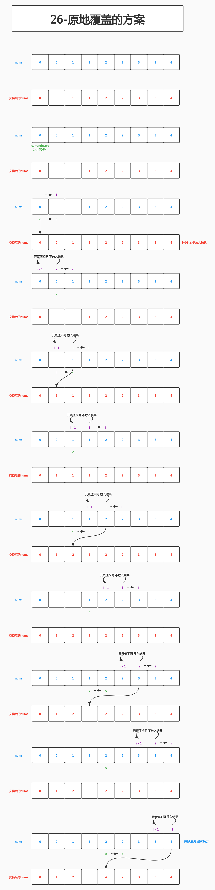

# 第1课 数组、链表、栈、队列

## PART1. 数组、链表原理讲解、实战应用

### 1.1 数组(Array)

- 连续内存空间
- 支持随机访问(起始地址+偏移量)

数组的关键:索引与寻址

### 1.2 变长数组(resizable array)

初始:空数组,分配常数空间

Push back:若空间不够,重新申请2倍大小的连续空间,拷贝至新空间,释放旧空间

Pop back:若空间利用率不到25%,则释放一半空间

设数组每一次扩容均需重新拷贝,则总拷贝次数为:


而级数


是一个收敛级数,收敛域为n.故:


Q:若释放空间的阈值为50%,会发生什么情况?

A:变长数组会在阈值附近反复的扩缩容,而扩缩容(假设每一次扩容均为重新拷贝)的每一次操作时间复杂度均为O(n),因此若阈值设定为50%,算法会退化.

### 1.2 变长数组的实现

```go
package array

import (
	"errors"
	"fmt"
)

type Array struct {
	array []interface{}
}

func (a *Array) Insert(index int, value interface{})  {
	a.check()
	if  0 < index && index < len(a.array) {
		// 主体思路:向数组中(非头尾)插入
		a.array = append(a.array, nil)
		copy(a.array[index:],a.array[index - 1:])
		a.array[index] = value
	} else if index == 0 {
		// 细节:向头部插入
		a.Prepend(value)
	} else if index == len(a.array) {
		// 细节:向尾部插入
		a.Append(value)
	} else {
		// 细节:待插入索引比当前数组长度要大
		padding := make([]interface{}, index - len(a.array))
		a.array = append(append(a.array, padding...),value)
	}
}

func (a *Array) check() {
	if a.array == nil {
		a.array = make([]interface{}, 0, 100)
	}
}

func (a *Array) Prepend(value interface{}) {
	a.check()
	a.array = append(a.array, nil)
	copy(a.array[1:], a.array[:])
	a.array[0] = value
}

func (a *Array) Append(value interface{}) {
	a.check()
	a.array = append(a.array, value)
}

func (a *Array) Delete(index int) {
	if 0 < index && index < len(a.array) {
		// 主体思路:删除数组中的元素
		// 细节:删除尾部的元素(和主体思路一致,合并处理)
		a.array = append(a.array[:index], a.array[index + 1:]...)
	} else if index == 0 {
		// 细节:删除头部的元素
		a.array = a.array[1:]
	} else if 0 > index || index >= len(a.array) {
		// 细节:索引越界
		err := errors.New("out of range")
		fmt.Printf("%v\n", err.Error())
	}
}

func (a *Array) Lookup() {
	a.check()
	fmt.Printf("%v\n", a.array)
}
```

### 1.3 实战

#### 1.3.1 合并有序数组

[合并有序数组](https://leetcode-cn.com/problems/merge-sorted-array/)

##### 解决方案1:开辟一个新的数组

**该方案不是原地操作,所以实际上并不能解题.仅提供一个解题的思路.**

解题思路:开辟一个容量为`m + n`的新数组`result`,置两个指针`i`、`j`,分别遍历`nums1`和`nums2`,将`nums1[i]`和`nums2[j]`二者较小的元素`append`到`result`中.


```go
func merge(nums1 []int, m int, nums2 []int, n int) {
	result := make([]int, 0, m + n)

	// nums2是空slice
	if n == 0 {
		for _, v := range nums1 {
			result = append(result, v)
			fmt.Printf("%v\n", result)
		}
		return
	}

	// nums1是空slice
	if m == 0 {
		for _, v := range nums2 {
			result = append(result, v)
			fmt.Printf("%v\n", result)
		}
		return
	}

	j := 0

	for i := 0; i <= m - 1; i++ {
		if nums1[i] < nums2[j] {
			// i小j大 放i i+1 j不动
			result = append(result, nums1[i])
		} else {
			// j小i大 或 ij相等 放j j+1 i不动
			result = append(result, nums2[j])
			j++
			i--
		}

		// i循环完了还有j 把j都放到结果中
		if i == m - 1 && j <= n - 1 {
			for ;j <= n - 1; j++ {
				result = append(result, nums2[j])
			}
		}

		// j循环完了还有i 把i放到结果中
		if j > n - 1 {
			if i < 0 {
				for k, v := range nums1 {
					if k <= m - 1 {
						result = append(result, v)
					} else {
						break
					}
				}
			} else {
				for ; i < m - 1; i++ {
					result = append(result, nums1[i])
				}
			}
			break
		}
	}

	fmt.Printf("%v\n", result)
}
```

##### 解决方案2:将nums2的元素插入到nums1中

会出现值覆盖的问题.不能用结果覆盖输入.


##### 解决方案3:由于nums1结尾处有用于补位的0,所以对nums1和nums2,从后向前遍历

主体思路:对nums1和nums2,从后向前遍历.二者中较大的值放到nums1的尾部.

```go
func merge(nums1 []int, m int, nums2 []int, n int) {
	i := m - 1
	j := n - 1
	checkIndex := m + n - 1
	
	for ; checkIndex >= 0; checkIndex-- {
		// 主体思路:对nums1和nums2 从后向前遍历 二者中较大的值 放到nums1的尾部
		if nums1[i] > nums2[j] {
			nums1[checkIndex] = nums1[i]
			i--
		} else {
			nums1[checkIndex] = nums2[j]
			j--
		}
	}
}
```

细节问题:索引越界.由于`i`和`j`在不断减小,导致会出现索引越界问题.当`i < 0`时,意味着`nums1`中的元素都处理完了,只有`nums2`中还剩下没被放置的元素.反之,当`j < 0`时,意味着`nums2`中的元素都处理完了,只有`nums1`中还剩下没被放置的元素.

```go

func merge(nums1 []int, m int, nums2 []int, n int) {
	i := m - 1
	j := n - 1
	checkIndex := m + n - 1

	for ; checkIndex >= 0; checkIndex-- {
		// 细节:处理i j的索引越界问题
		if i < 0 {
			// nums1都处理完了 只剩nums2了
			nums1[checkIndex] = nums2[j]
			j--
			continue
		}

		if j < 0 {
			nums1[checkIndex] = nums1[i]
			i--
			continue
		}

		// 主体思路:对nums1和nums2 从后向前遍历 二者中较大的值 放到nums1的尾部
		if nums1[i] > nums2[j] {
			nums1[checkIndex] = nums1[i]
			i--
		} else {
			nums1[checkIndex] = nums2[j]
			j--
		}
	}
}
```

代码美化:可以看到在`for`循环中,`i < 0`的代码块和`nums1[i] > nums2[j]`的代码块中代码几乎相同;`j < 0`的代码块和后续的`else`代码块中代码几乎也相同.尝试将条件合并.

```go
func merge(nums1 []int, m int, nums2 []int, n int) {
	i := m - 1
	j := n - 1
	checkIndex := m + n - 1

	for ; checkIndex >= 0; checkIndex-- {
		// 主体思路:对nums1和nums2 从后向前遍历 二者中较大的值 放到nums1的尾部
		if j < 0 || (i >= 0 && nums1[i] > nums2[j]) {
			nums1[checkIndex] = nums1[i]
			i--
		} else {
			// 等价于 j >= 0 && !(i >= 0 && nums1[i] > nums2[j])
			// 等价于 j >= 0 && (i < 0 || nums1[i] <= nums2[j])
			// 本段逻辑同样适用于当i < 0 且nums2中还有没处理的元素时(即j > 0时)
			nums1[checkIndex] = nums2[j]
			j--
		}
	}
}
```

简单的布尔代数:

```

结合律:

A AND (B AND C) = (A AND B) AND C

A OR (B OR C) = (A OR B) OR C

分配律:

A AND (B OR C) = (A AND B) OR (A AND C)

A OR (B AND C) = (A OR B) AND (A OR C)

德摩根定律:

!(A AND B) = !A OR !B

!A AND !B = !(A OR B)

```


#### 1.3.2 去重

[去重](https://leetcode-cn.com/problems/remove-duplicates-from-sorted-array/)

##### 解决方案1:使用一个额外的Array

和上一题相同,此处使用额外的Array作为结果数组,是不符合题目要求的,非原地的算法.但为了明确主体思路,也写一遍.

主要问题:判断一个元素在何种条件下放入结果数组中.

因此,主体思路就明确了.

主体思路:由于题设已经告知是一个排好序的数组,所以当一个元素与其前边的元素值不同时,就放入结果数组中.

细节:对于`nums`中的第1个元素(`i = 0`时),若判断`nums[i - 1]`,则必然越界.但是,`nums`中的第1个元素是必然放入结果数组中的,因此不需判断.

```go
func removeDuplicates(nums []int) []int {
	result := make([]int, 0, len(nums) - 1)
	for i := 0; i <= len(nums) - 1; i++ {
		if i == 0 {
			result = append(result, nums[i])
		} else {
			if nums[i] != nums[i - 1] {
				result = append(result, nums[i])
			}
		}
	}
	return result
}
```

美化代码:

```go
func removeDuplicates(nums []int) []int {
	result := make([]int, 0, len(nums) - 1)
	for i := 0; i <= len(nums) - 1; i++ {
		if i == 0 || nums[i] != nums[i - 1] {
			result = append(result, nums[i])
		}
	}
	return result
}
```


##### 解决方案2:不使用结果数组,原地覆盖

如果想要原地覆盖,就还需要一个指针.该指针用于标记待交换的位置.

// TODO:图改名


```go
func removeDuplicates(nums []int) int {
	currentInsert := 0
	for i := 0; i <= len(nums) - 1; i++ {
		if i == 0 || nums[i] != nums[i - 1] {
			nums[currentInsert] = nums[i]
			currentInsert++
		}
	}
	return currentInsert
}
```

##### 解决方案3:基于原地交换的优化

TODO:这种优化所针对的情况本不该出现在题目中,但不知道为什么,按照这种思路优化代码之后,执行时间变短了(试过很多次,不是偶发现象).

Q:i何时不需再向后遍历了?

A:

1. i到达尾部,如上图描述中的那种情况
2. 由于题设中表明是升序数组,所以当`nums[i] < nums[i - 1]`时,说明后续的所有元素都不需要检测了,直接结束循环即可.


```go
func removeDuplicates(nums []int) int {
	currentInsert := 0
	for i := 0; i <= len(nums) - 1; i++ {
		if i == 0 || nums[i] > nums[i - 1] {
			nums[currentInsert] = nums[i]
			currentInsert++
		}
		if i !=0 && i != len(nums) - 1 && nums[i] < nums[i - 1] {
			break
		}
	}
	return currentInsert
}
```


## PART2. 栈、队列及其常见变形、实战应用


