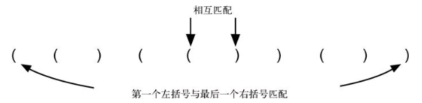

# 第3章 基本数据结构

## 3.2 何谓线性数据结构

线性数据结构:栈、队列、双端队列和列表都是**有序的数据集合.其元素的顺序取决于添加顺序或移除顺序.**一旦某个元素被添加进来,它与前后元素的相对位置将保持不变.

真正区分线性数据结构的是元素的添加方式和移除方式,尤其是添加操作和移除操作发生的位置.

## 3.3 栈

### 3.3.1 何谓栈

- 有序集合
- 添加操作和移除操作总发生在同一端

栈中的元素离底端越近,代表该元素在栈中的时间越长.最新添加的元素将被最先移除.这种排序原则被称为LIFO(Last-in first-out),即**后进先出.**

**栈提供了一种基于元素在集合中存在的时间来排序的方式.**

也就是说,栈提供的序,是一种时间序.在栈内存在时间越长的元素,其"序"越靠近栈底;在栈内存在时间越短的元素,其"序"越靠近栈顶.

在栈中,元素的插入顺序正好与移除顺序相反.

### 3.3.2 实现栈

```go
package stack

import (
	"errors"
	"fmt"
)

type Stack struct {
	// 数组尾部为栈顶 头部为栈底
	items []interface{}
}

func (s *Stack) IsEmpty() bool {
	return len(s.items) == 0
}

func (s *Stack) Push(item interface{}) {
	s.items = append(s.items, item)
}

func (s *Stack) Pop() (item interface{}, err error) {
	if s.IsEmpty() {
		return nil, errors.New("stack is empty")
	}

	item = s.items[len(s.items) - 1]
	s.items = s.items[:len(s.items) - 1]
	return item, nil
}

func (s *Stack) Peek() (item interface{}, err error) {
	if len(s.items) == 0 {
		return nil, errors.New("stack is empty")
	}

	item = s.items[len(s.items) - 1]
	return item, nil
}

func (s *Stack) Size() int {
	return len(s.items)
}

func (s *Stack) Check() {
	for i := len(s.items) - 1; i >= 0; i-- {
		fmt.Printf("%v\n", s.items[i])
	}
}
```

****

注:`Check()`方法是实现时用于调试的.并非一个必要方法.以下实现同样.

****

本实现的思路为:**以数组尾部模拟栈顶,以数组头部模拟栈底.这样`Push()`和`Pop()`方法的时间复杂度均为O(1).**

反之,以数组头部模拟栈顶,以数组尾部模拟栈底的实现也是可以的.只是`Push()`和`Pop()`方法的时间复杂度为O(n).

### 3.3.4 匹配括号

#### 题目要求

匹配括号:每一个`(`都有与之相对应的一个`)`,且括号对(即`()`)有正确的嵌套关系.给定一个仅包含仅包含`(`和`)`的字符串,判定该字符串中`(`和`)`是否相匹配.

#### 解题思路

##### step1. 审题

- 很明显想要得知给定的字符串是否有正确的匹配关系,需要遍历每个字符才能得到最终结果
- 从左到右遍历时,每当遍历到一个`)`,意味着从该`)`向左,出现的第1个`(`被匹配了
- 但这同样意味着,第一个出现的`(`,有可能最后才能被匹配
- 进而可以得出结论:遍历的过程中,`(`需要缓存.
- 对于所有被缓存起来的`(`而言,不仅需被缓存,而且需要记录时序(即先后顺序).因为每当遇到一个`)`,其含义为**最后一个被缓存的`(`被匹配了**



##### step2. 根据审题结果,寻找合适的数据结构

审题结果中有2个关键字:

1. 缓存
2. 时序相反

对于时序而言,最重要的一点在于:后出现的`(`先被匹配,先出现的`(`后被匹配.

即:**`(`的匹配顺序与出现顺序相反**

因此,应该使用一种LIFO性质的数据结构来解决这个问题.所以使用栈来解决

##### step3. 结合数据结构,列出解题思路

1. 遍历时遇到`(`就入栈
2. 遇到`)`时:

	- 若栈不为空,则出栈,表示栈顶的`(`被匹配到了
	- 若栈为空,则说明出现了一个无法被匹配到的`)`,可以得出结论:给定的字符串不匹配

3. 遍历结束后,检测栈是否为空.为空则说明给定字符串匹配,否则说明有`(`未被匹配

#### 解题

```go
package parenthesisChecker

import stack2 "code/dataStructure/stack"

func OnlyParenthesisChecker(symbol string) bool {
	stack := stack2.Stack{}
	for i := 0; i < len(symbol); i++ {
		if symbol[i] == '(' {
			stack.Push(symbol[i])
		}

		if symbol[i] == ')' {
			if stack.IsEmpty() {
				return false
			} else {
				stack.Pop()
			}
		}
	}

	return stack.IsEmpty()
}
```

当然,由于题设中给定了只有`(`和`)`,所以还可以使用一种偷鸡的解法:检测给定的字符串中`(`数量和`)`数量是否相等.若相等则必然匹配,否则必然不匹配.

```go
package parenthesisChecker

func FreeRidingParenthesisChecker(symbol string) bool {
	var leftParenthesis int
	var rightParenthesis int
	for i := 0; i < len(symbol); i++ {
		if symbol[i] == '(' {
			leftParenthesis++
		} else {
			rightParenthesis++
		}
	}

	return leftParenthesis == rightParenthesis
}
```

### 3.3.5 普通情况:匹配符号

#### 题目要求

匹配符号:

- 定义`([{`为左符号
- 定义`)]}`为右符号
- 给定一个字符串,该字符串中仅包含字符`([{)]}`.要求判定该字符串中左符号与右符号是否匹配.要求不仅每一个左符号都有一个右符号与之对应,而且两个符号的类型必须相同.即`(`必须匹配`)`,`[`必须匹配`]`,`{`必须匹配`}`

例:`{{([][])}()}` `[[{{(())}}]]` `[][][](){}`均为匹配的字符串;`([)]` `((()]))` `[{()]`均为不匹配的字符串.

#### 解题思路

##### step1. 审题

- 和上一题相同,想要得到是否匹配,同样需要遍历字符串中的每个字符,才能得到最终结果
- 从左到右遍历时,每当遍历到一个右符号,意味着从该右符号向左,出现的第1个左符号,需要与该右符号进行类型比对
	
	- 若该左符号的类型与右符号相同,则类型比对成功,继续后续的遍历
	- 若该左符号的类型与右符号不同,则类型比对失败,说明发生了形似`([)]`的不正确嵌套关系,说明该字符串不匹配
- 和上一题相同,这个过程意味着第1个出现的左符号,有可能最后才能被匹配
- 这个过程要求在遍历的过程中,所有的左符号需要被缓存起来
- 同样地,对于所有被缓存起来的左符号,不仅需要缓存,还需要记录时序(即每个左符号在字符串中出现的相对先后顺序).因为每当遇到一个右符号,要做的操作是:比对该右符号向左出现的第1个左符号,二者类型是否相同

##### step2. 根据审题结果,寻找合适的数据结构

其实本质上这道题和上一题的主体思路完全相同.只是在检测是否匹配的这个步骤上,需要多做一步类型比对.

同样的,审题结果中有2个关键字:

1. 缓存
2. 时序相反

对于时序而言,最重要的一点在于:后出现的左符号先被匹配,先出现的左符号后被匹配.

即:**左符号的匹配顺序与出现顺序相反**

因此,应该使用一种LIFO性质的数据结构来解决这个问题.所以使用栈来解决

##### step3. 结合数据结构,列出解题思路

1. 遍历时遇到左符号就入栈
2. 遇到右符号时:

	- 若栈不为空,则与栈顶的左符号进行类型比对
		- 若二者类型不符,则说明无法匹配,可以得出结论:给定的字符串不匹配
		- 若二者类型相符,则将栈顶元素出栈,继续遍历

	- 若栈为空,则说明出现了一个无法被匹配到的右符号,可以得出结论:给定的字符串不匹配

3. 遍历结束后,检测栈是否为空.为空则说明给定字符串匹配,否则说明有左符号未被匹配

#### 解题

```go
package parenthesisChecker

import (
	stack2 "code/dataStructure/stack"
	"strings"
)

var leftSymbols string = "([{"

var rightSymbols string = ")]}"

func ParenthesisChecker(symbols string) bool {
	symbolRunes := []rune(symbols)
	stack := stack2.Stack{}
	for i := 0; i < len(symbolRunes); i++ {
		// 左括号 入栈
		if strings.ContainsRune(leftSymbols, symbolRunes[i]) {
			stack.Push(string(symbolRunes[i]))
		}

		// 右括号 栈顶比对
		if strings.ContainsRune(rightSymbols, symbolRunes[i]) {
			top, err := stack.Peek()
			// 栈为空 不匹配
			if err != nil {
				return false
			}
			
			// 类型比对
			if matches(top.(string), string(symbolRunes[i])) {
				stack.Pop()
			} else {
				return false
			}
		}
	}

	return stack.IsEmpty()
}

func matches(left, right string) bool {
	return strings.Index(leftSymbols, left) == strings.Index(rightSymbols, right)
}
```

### 3.3.6 将十进制数转换成二进制数

#### 题目要求

给定一个十进制的整数,返回该整数的二进制表示的字符串

#### 解题思路

##### step1. 审题

我们可以举一个十进制数18为例,来观察进制转换的过程


|除法算式|商|余数|
|:-:|:-:|:-:|
| 18 // 2 | 9 | 0 |
| 9 // 2 | 4 | 1 |
| 4 // 2 | 2 | 0 |
| 2 // 2 | 1 | 0 |
| 1 // 2 | 0 | 1 |

十进制数18的二进制表示:10010

这个过程中,有4个点需要关注:

1. 上一次除法的商,作为下一次除法的被除数
2. 除法运算直到被除数小于除数,或者说商为0时停止
3. 先得出的余数放在二进制表示的右侧,后得出的余数放在二进制的左侧.即:余数出现的时序和放置的时序相反
4. 根据上一结论,所有余数都需要被缓存

##### step2. 根据审题结果,寻找合适的数据结构

本题的审题结果中,同样出现了2个关键字:

1. 缓存
2. 时序相反

因此需要一种LIFO性质的数据结构来解决这个问题.所以使用栈

##### step3. 结合数据结构,列出解题思路

1. 循环进行除法运算.循环结束的条件为:被除数小于2(抽象一点可以认为是被除数小于要转换的进制数)
2. 每次得到的余数入栈
3. 当循环结束时,被除数直接入栈
4. 栈内元素依次出栈

#### 解题

```go
package divideBy2

import (
	stack2 "code/dataStructure/stack"
	"strconv"
)

func DivideBy2(dec int) (bin string) {
	var remainders stack2.Stack = stack2.Stack{}

	for dec > 1 {
		remainders.Push(dec % 2)
		dec = dec / 2
	}
	remainders.Push(dec)

	for !remainders.IsEmpty() {
		binChar, _ := remainders.Pop()
		bin += strconv.Itoa(binChar.(int))
	}
	return bin
}
```

### 3.3.7 前序、中序和后序表达式

#### 题目要求

给定一个以字符串表示的中序表达式(该中序表达式中没有括号),将该中序表达式转换为后序表达式

中序表达式:操作符在2个操作数中间的表达式

后序表达式:操作符在2个操作数后边的表达式

|中序表达式|前序表达式|后序表达式|
|:-:|:-:|:-:|
|A + B|+ A B|A B +|
|A + B * C|+ A * B C|A B C * +|
|A + B * C + D|+ + A * B C D|A B C * + D +|

#### 解题思路

##### step1. 审题

- 从题目给的示例中可以观察到一个现象:中序表达式转换为前序表达式或后序表达式时,**操作数的相对顺序不变.**这意味着只有操作符需要变换顺序,而操作数不需要做任何操作
- 想要得到一个中序表达式对应的后序表达式,必然需要遍历整个中序表达式的每一个字符(此处的字符其实就是中序表达式当中的每一个操作数和操作符),才能得到一个完整的后序表达式.因此遍历是一个必然要进行的操作
- 从熟悉的中序表达式入手,以中序表达式`A + B * C / D`为例,可以得出以下结论:
	- 操作符是有优先级属性的.`*`和`/`的优先级高于`+`和`-`
	- 操作符的优先级导致先出现的操作符有可能后计算.比如本例中`A + B`中的`+`,就需要等到后续的`B * C`和`E / D`(设`B * C = E`)计算完毕之后,`+`才能被计算.因此先出现的操作符需要被缓存起来,当该操作符可以被计算时,再放入结果中
	- 由上一点进一步抽象,得出结论:**从左到右遍历,当后一个操作符的优先级 <= 前一个操作符的优先级时,意味着前一个操作符是可计算的.**换言之,**操作符的出现顺序与可计算的顺序是相反的**,也可以说是操作符在中序表达式中的出现顺序和在后续表达式中的出现顺序是相反的.


##### step2. 根据审题结果,寻找合适的数据结构

本题的审题结果中,同样出现了2个关键字:

1. 缓存
2. 时序相反

因此需要一种LIFO性质的数据结构来解决这个问题.所以使用栈

##### step3. 结合数据结构,列出解题思路

1. 遍历中序表达式

	- 若为操作数,则直接放入结果即可
	- 若为操作符,则需分类讨论:
		- 若此时栈为空,说明该操作符为中序表达式中的第1个操作符,或者该操作符之前的所有操作符均已经被计算过了.此时需将该操作符入栈
		- 若此时栈不为空,则需要比较当前操作符与栈顶操作符的优先级.若当前操作符的优先级 <= 栈顶操作符的优先级,则将栈顶的操作符出栈,放入结果中.
		- 出栈操作直到栈为空或当前操作符的优先级 > 栈顶操作符的优先级为止.
		- 将当前操作符压入栈内

2. 遍历结束后

	 - 若栈不为空,则将栈内元素弹出,放入结果中.直到栈为空为止.

#### 解题

```go
package infixToPostfix

import stack2 "code/dataStructure/stack"

var operatorPriority map[string]int = map[string]int{
	"+": 0,
	"-": 0,
	"*": 1,
	"/": 1,
}

func InfixToPostfix(infix string) (postfix string) {
	var operatorStack stack2.Stack = stack2.Stack{}
	for i := 0; i < len(infix); i++ {
		_, ok := operatorPriority[string(infix[i])]
		if !ok {
			// 操作数 直接放入结果
			postfix += string(infix[i])
		} else {
			if operatorStack.IsEmpty() {
				// 栈为空 则直接入栈
				operatorStack.Push(infix[i])
			} else {
				// 栈不为空 和栈顶操作符比较优先级 栈顶操作符优先级 >= 当前操作符优先级 则弹出栈顶操作符 放入结果中
				// 直到栈为空 或 栈顶操作符优先级 < 当前操作符为止
				// 最后将当前操作符压入栈内
				for {
					// 栈为空 将当前操作符压入栈内
					if operatorStack.IsEmpty() {
						operatorStack.Push(infix[i])
						break
					}

					topOperator, _ := operatorStack.Peek()

					// 栈顶操作符优先级 < 当前操作符优先级 将当前操作符压入栈内
					if operatorPriority[string(topOperator.(uint8))] < operatorPriority[string(infix[i])] {
						operatorStack.Push(infix[i])
						break
					}

					// 栈顶操作符优先级 >= 当前操作符优先级 则弹出栈顶操作符 放入结果中
					top, _ := operatorStack.Pop()
					postfix += string(top.(uint8))
				}
			}
		}
	}

	for !operatorStack.IsEmpty() {
		topOperator, _ := operatorStack.Pop()
		postfix += string(topOperator.(uint8))
	}
	return
}
```

美化一下之后,最终成品为:

```go
package infixToPostfix

import stack2 "code/dataStructure/stack"

var operatorPriority map[string]int = map[string]int{
	"+": 0,
	"-": 0,
	"*": 1,
	"/": 1,
}

func InfixToPostfix(infix string) (postfix string) {
	var operatorStack stack2.Stack = stack2.Stack{}
	for i := 0; i < len(infix); i++ {
		_, ok := operatorPriority[string(infix[i])]
		if !ok {
			// 操作数 直接放入结果
			postfix += string(infix[i])
			continue
		}

		// 操作符
		for {
			// 栈为空 将当前操作符压入栈内
			if operatorStack.IsEmpty() {
				operatorStack.Push(infix[i])
				break
			}

			// 栈不为空 检查栈顶操作符的优先级 与当前操作符的优先级比对
			topOperator, _ := operatorStack.Peek()

			// 栈顶操作符优先级 < 当前操作符优先级 将当前操作符压入栈内
			if operatorPriority[string(topOperator.(uint8))] < operatorPriority[string(infix[i])] {
				operatorStack.Push(infix[i])
				break
			}

			// 栈顶操作符优先级 >= 当前操作符优先级 则弹出栈顶操作符 放入结果中
			top, _ := operatorStack.Pop()
			postfix += string(top.(uint8))
		}
	}

	for !operatorStack.IsEmpty() {
		topOperator, _ := operatorStack.Pop()
		postfix += string(topOperator.(uint8))
	}
	return
}
```

#### 进阶:带有括号的中序表达式

给定一个以字符串表示的中序表达式(该中序表达式中有括号),将该中序表达式转换为后序表达式

|中序表达式|前序表达式|后序表达式|
|:-:|:-:|:-:|
|(A + B) * (C + D)|* + A B + C D|A B + C D + *|
|(A + B) * C - (D - E) * (F + G)|- * + A B C * - D E + F G|A B + C * D E - F G + * -|

#### 解题思路

##### step1. 审题

在上一题的基础上,我们发现:

- 带有括号的中序表达式转换为后序表达式时,并没有因为括号而导致操作数的相对顺序发生变化.也就是说,**操作数的相对顺序不变**这一结论依旧成立,不受括号影响
- 无论是否有括号,想要得到一个中序表达式对应的后序表达式,依旧都需要遍历
- 以中序表达式`(A + B) * (C + D)`为例,得出以下结论:
	- `(`只能出现在表达式的开头或一个操作符之后,操作数之前
	- `)`只能出现在表达式的结尾或一个操作数之后,操作符之前
	- `(`的出现标志着在一个完整的中序表达式中,有一段子表达式会无视操作符的运算优先级,该子表达式的优先级会被提升
	- `)`的出现标志着在一个完整的中序表达式中,上一点中提到的需要被提升运算优先级的子表达式结束了,这段子表达式应该被计算了
	- 所以在遍历时,当遍历到`(`时,需要将该`(`缓存起来,其目的在于标记需要被提升计算优先级的子表达式的开始
	- 当遍历到`)`时,需要将与该`)`对应的`(`之间的子表达式进行计算.此处所谓的进行计算,指的是将括号内的子表达式转换为后序表达式并放入结果中.而所谓的与`)`对应的`(`,其实就是`)`向左遇到的第1个`(`
	- 综上,得出结论:**从左到右遍历,若遇到`(`则缓存;若遇到`)`则将与之对应的`(`之间的子表达式计算,其他规则与上一题不变**

##### step2. 根据审题结果,寻找合适的数据结构

本题的审题结果中,同样出现了2个关键字:

1. 缓存
2. 时序相反

因此需要一种LIFO性质的数据结构来解决这个问题.所以使用栈

##### step3. 结合数据结构,列出解题思路

1. 遍历中序表达式

	- 若为操作数,则直接放入结果即可
	- 若为`(`,则将该`(`入栈
	- 若为`)`,则持续将栈内的操作符弹出并放入结果内,直到弹出的是`(`为止
	- 其他逻辑与上一题不变.只是在比对当前符号与栈顶符号的优先级时,若栈顶为`(`,则将当前符号直接压入栈内即可

2. 遍历结束后

	 - 若栈不为空,则将栈内元素弹出,放入结果中.直到栈为空为止.

#### 解题

```go
import (
	stack2 "code/dataStructure/stack"
)

var operatorPriority map[string]int = map[string]int{
	"+": 0,
	"-": 0,
	"*": 1,
	"/": 1,
}

func InfixToPostfixWithParentheses(infix string) (postfix string) {
	var operatorStack stack2.Stack = stack2.Stack{}
	for i := 0; i < len(infix); i++ {
		// 左括号 入栈
		if string(infix[i]) == "(" {
			operatorStack.Push(infix[i])
			continue
		}

		_, ok := operatorPriority[string(infix[i])]

		// 操作数 直接放入结果
		if string(infix[i]) != "(" && string(infix[i]) != ")" && !ok {
			postfix += string(infix[i])
			continue
		}

		// 右括号 持续出栈直到出栈元素为左括号为止
		if string(infix[i]) == ")" {
			for {
				topOperator, _ := operatorStack.Pop()
				if string(topOperator.(uint8)) == "(" {
					break
				}

				postfix += string(topOperator.(uint8))
			}
			continue
		}

		// 操作符
		for {
			// 栈为空 将当前操作符压入栈内
			if operatorStack.IsEmpty() {
				operatorStack.Push(infix[i])
				break
			}

			// 栈不为空 检查栈顶操作符的优先级 与当前操作符的优先级比对
			topOperator, _ := operatorStack.Peek()

			// 栈顶操作符优先级 < 当前操作符优先级 或 栈顶为(时 将当前操作符压入栈内
			topStr := string(topOperator.(uint8))
			if operatorPriority[topStr] < operatorPriority[string(infix[i])] || topStr == "(" {
				operatorStack.Push(infix[i])
				break
			}

			// 栈顶操作符优先级 >= 当前操作符优先级 则弹出栈顶操作符 放入结果中
			top, _ := operatorStack.Pop()
			postfix += string(top.(uint8))
		}
	}

	for !operatorStack.IsEmpty() {
		topOperator, _ := operatorStack.Pop()
		postfix += string(topOperator.(uint8))
	}
	return
}
```

#### 解题思路优化-更为抽象且通用的方式

##### step1. 审题

- 通过观察一个中序表达式,可以得出如下结论:
	- `(`实际的作用是一个标记.标记了一段要被提高运算优先级的子表达式的开始
	- `)`实际的作用也是一个标记.标记了一段要被提高运算优先级的子表达式的结束
	- 但实际上影响了运算优先级变化的,是`)`而非`(`
	- 因此可以得出结论:**`(`并没有改变运算符的优先级.**
	- 更进一步的,这句话隐含的意义是:既然`(`没有改变运算符的优先级,那么就可以认为`(`的运算优先级是最低的,低于`+`和`-`

##### step2. 根据审题结果,寻找合适的数据结构

这一步的思路和上边一样,并没有任何改变

##### step3. 结合数据结构,列出解题思路

1. 定义操作符与优先级的映射关系,其中`(`的优先级为最低
2. 遍历中序表达式

	- 若为操作数,则直接放入结果
	- 若为`(`,则直接入栈
	- 若为操作符,则与栈顶操作符比较优先级
		- 若栈顶操作符优先级 >= 当前操作符优先级,则持续将栈顶操作符出栈,直到栈顶操作符优先级低于当前操作符,或栈为空为止.再将当前操作符入栈
		- 若栈顶操作符优先级 < 当前操作符优先级,则将当前操作符入栈
	- 若为`)`,则持续将操作符出栈,直到出栈的操作符为`(`为止

3. 遍历结束后

	 - 若栈不为空,则将栈内元素弹出,放入结果中.直到栈为空为止.

#### 解题

```go
package infixToPostfix

import (
	stack2 "code/dataStructure/stack"
)

var operatorPriority map[string]int = map[string]int{
	"(": 0,
	"+": 1,
	"-": 1,
	"*": 2,
	"/": 2,
}

func InfixToPostfixWithParentheses(infix string) (postfix string) {
	var operatorStack stack2.Stack = stack2.Stack{}

	for i := 0; i < len(infix); i++ {
		token := string(infix[i])

		_, ok := operatorPriority[token]

		// 操作数 直接放入结果
		if !ok && token != ")" {
			postfix += token
			continue
		}

		// ) 持续出栈直到遇见(为止
		if token == ")" {
			for {
				top, _ := operatorStack.Pop()
				if top.(string) == "(" {
					break
				}

				postfix += top.(string)
			}
			continue
		}

		// 操作符
		for {
			// 栈为空 或 操作符为( 将当前操作符压入栈顶即可
			if operatorStack.IsEmpty() || token == "(" {
				operatorStack.Push(token)
				break
			}

			top, _ := operatorStack.Peek()

			// 若栈顶操作符优先级 >= 当前操作符优先级 则持续弹出 直到栈为空 或 栈顶操作符优先级 < 当前操作符优先级为止
			if operatorPriority[top.(string)] >= operatorPriority[token] {
				topOperator, _ := operatorStack.Pop()
				postfix += topOperator.(string)
			}

			// 若栈顶操作符优先级 < 当前操作符优先级 则将当前操作符压入栈内即可
			if operatorPriority[top.(string)] < operatorPriority[token] {
				operatorStack.Push(token)
				break
			}
		}
	}

	// 遍历结束 将栈内剩余操作符放入结果
	for !operatorStack.IsEmpty() {
		topOperator, _ := operatorStack.Pop()
		postfix += topOperator.(string)
	}

	return postfix
}
```

#### 进阶:后序表达式转换为中序表达式

#### 题目要求

将一个后序表达式转换为中序表达式

|后序表达式|中序表达式|
|:-:|:-:|
|A B C * +|A + B * C|
|A B + C *|(A + B) * C|
|A B + C * D E - F G + / -|(A + B) * C - (D - E) / (F + G)|


#### 解题思路

##### step1. 审题

- 观察后序表达式,可以发现:
	- 在后序表达式中,没有操作符运算优先级这一概念.运算过程为从左到右,每遇到一个操作符,就取该操作符左侧的2个操作数进行运算.最终得出结果
	- **没有操作符运算优先级,意味着在后序表达式中,没有`()`,但中序表达式为了调整操作符的优先级,需要有`()`**
	- 后序表达式中,每个操作符左侧的操作数,有可能是由一段表达式构成的.例如`A B + C *`中,对于`*`而言,`A B +`是一个操作数,`C`是另一个操作数.**这意味着操作数(一段子表达式的计算结果同样是操作数)需要缓存**
	- 后序表达式的操作数出现的顺序代表了其运算的顺序.例如`A B - C +`转换为中序表达式为`A - B + C`,而不是`B - A + C`.**这意味着当遇到一个操作符时,操作数从缓存区取出的顺序需要和操作数在后序表达式中的出现顺序相同**

- 若想要将一个后序表达式转换为中序表达式,同样是需要遍历的
	- 若遍历到一个操作数,则缓存
	- 若遍历到一个操作符,则需要把该操作符左侧的2个操作数从缓存区中取出,在中序表达式中先出现的操作数放在操作符的前面,在中序表达式中后出现的操作数放在操作符的后面.即:**操作数从缓存区中取出的顺序和参与运算的顺序是相同的**
	- 运算完成后,需要给这个子表达式的左右两侧加上`()`.因为有可能在该子表达式后,出现的是一个比该子表达式中的运算优先级要高的操作符.为了保证在中序表达式中的运算顺序,需要在该子表达式的左右两侧加上`()`
	- 而这个子表达式实际上表示的就是一个运算结果.而一个运算结果就是一个操作数.只要是操作数就需要缓存,因此需要将这个子表达式作为一个操作数看待,再放回缓存区中.以便遍历到下一个操作符时,将该子表达式作为操作数使用
	- 遍历结束后,缓存区内只有一个操作数,这个操作数由一个表达式构成.而这个表达式就是该后序表达式对应的中序表达式

##### step2. 根据审题结果,寻找合适的数据结构

本题的审题结果中,出现了2个关键字:

1. 缓存
2. 时序相同

因此需要一种FIFO性质的数据结构来解决这个问题.因此其实应该使用队列.但使用栈同样能解决这个问题.此处先用栈来解决,同样也会给出使用队列来解决的代码

##### step3. 结合数据结构,列出解题思路

1. 遍历后序表达式
	- 若为操作数,则压入栈内
	- 若为操作符,则将栈顶的操作数弹出.这个弹出的操作要做2次.
	- 先弹出的操作数放在操作符的后边,后弹出的操作数放在操作符的前边.此时这2个操作数和1个操作符,就构成了一个运算结果,即构成了一个新的操作数
	- 将这个新的操作数左右两侧添加`()`后压入栈顶

2. 遍历结束后

	- 弹出栈顶元素并返回即可.

#### 解题

```go
package postfixToInfix

import stack2 "code/dataStructure/stack"

func PostfixToInfix(postfix string) (infix string) {
	var operandStack stack2.Stack = stack2.Stack{}
	for i := 0; i < len(postfix); i++ {
		token := string(postfix[i])

		if token == " " {
			continue
		}

		operatorRes := isOperator(token)
		// 操作数 入栈
		if !operatorRes {
			operandStack.Push(token)
		} else {
			// 操作符 取出栈顶的2个元素 先弹出的元素放在操作符后面 后弹出的元素放在操作符前面
			// 将运算结果再压入栈内
			tailOperand, _ := operandStack.Pop()
			headOperand, _ := operandStack.Pop()
			operateRes := "(" + headOperand.(string) + token + tailOperand.(string) + ")"
			operandStack.Push(operateRes)
		}
	}
	res, _ := operandStack.Pop()
	return res.(string)
}

func isOperator(token string) bool {
	var operators []string = []string{"+", "-", "*", "/"}
	for _, v := range operators {
		if v == token {
			return true
		}
	}
	return false
}
```

## 3.4 队列

### 3.4.1 何谓队列

- 有序集合
- 添加操作和移除操作总发生在不同端

队列是有序集合,添加操作发生在"尾部",移除操作则发生在"头部".新元素从尾部进入队列,然后一直向前移动到头部,直到成为下一个被移除的元素.

队列中的元素离队头越近,代表该元素在队列中存在的时间越长.最新添加的元素将被最后移除.这种排序原则被称为FIFO(first-in first-out),即**先进先出**.

**队列提供了一种基于元素在集合中存在的时间来排序的方式.**

队列提供的序,也是一种时间序.在队列内存在时间越长的元素,其"序"越靠近队头;在队列内存在时间越短的元素,其"序"越靠近队尾.

在队列中,元素的插入顺序与移除顺序相同.

### 3.4.2 实现队列

```go
package queue

import (
	"errors"
	"fmt"
)

type Queue struct {
	// 数组尾部为队头 头部为队尾(个人感觉这样比尾部表示队尾 头部表示队头好写)
	queue []interface{}
}

func (q *Queue) IsEmpty() bool {
	return len(q.queue) == 0
}

func (q *Queue) Enqueue(item interface{}) {
	q.queue = append(q.queue, item)
}

func (q *Queue) Dequeue() (item interface{}, err error) {
	if q.IsEmpty() {
		return nil, errors.New("queue is empty")
	}

	item = q.queue[0]
	q.queue = q.queue[1:]
	return item, nil
}

func (q *Queue) Size() int {
	return len(q.queue)
}

func (q *Queue) Check() {
	for i := len(q.queue) - 1; i >= 0; i-- {
		fmt.Printf("%v\n", q.queue[i])
	}
}
```

### 3.4.4 模拟:传土豆

#### 题目要求

现有N个玩家围成一个环,并依次传递一个土豆.设传递行为每发生M次后,持有土豆的玩家将被移出环,剩下的玩家以不变的顺序再次组成一个环,继续传递土豆.直到只剩1个玩家时,游戏结束.该玩家为获胜者.

请设计一个函数,假设有6个玩家参加这个游戏.对任意给定的传递次数,求最终的获胜者姓名.

#### 解题思路

##### step1. 审题


##### step2. 根据审题结果,寻找合适的数据结构

##### step3. 结合数据结构,列出解题思路

#### 解题


